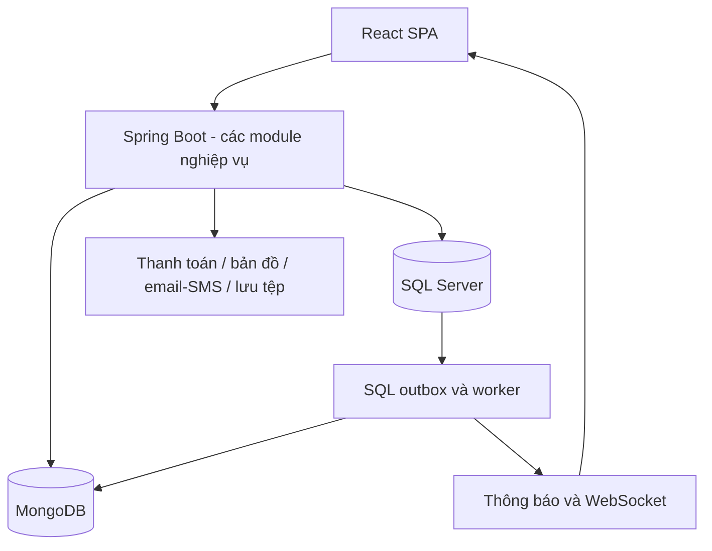

# Kiến trúc và module FPTPost

FPTPost là ứng dụng giao hàng tiện đường P2P. Nguồn thiết kế:
[SPEC v1.0](sources/fptpost-spec-v1.0.pdf), mục 2.4–2.7, và
[Excel v1.0](sources/fptpost-br-uc-v1.0.xlsx). Các module bên dưới là dự kiến;
repository hiện chỉ có Product/Activity/Health mẫu.

## Kiến trúc mục tiêu

Một backend Spring Boot chia module, React SPA gọi REST/WebSocket. SQL Server
quản lý giao dịch/trạng thái nghiệp vụ; MongoDB lưu dữ liệu sự kiện.

Sơ đồ thể hiện thiết kế cần xây, không phải toàn bộ thành phần đang chạy.
Phiên bản công nghệ thực tế xem README; SPEC v1.0 vẫn ghi stack cũ.

## Ranh giới module theo SPEC

| Module | Phân hệ sheet | Trách nhiệm | Phụ thuộc cho phép |
| --- | --- | --- | --- |
| identity | AUTH, KYC | Tài khoản, role, phiên, hồ sơ, KYC | common, audit |
| catalog | ADM, SAF | Loại hàng, khu vực, điểm hẹn, tham số, nội dung/từ khóa | common |
| order | ORD | Đơn, trạng thái/lịch sử, phí hủy | identity, catalog, pricing, ledger |
| pricing | FEE | Giá, hoa hồng, khuyến mãi | catalog |
| market | MKT, TRP, REL | Sàn, chào giá, chuyến đi, ghép/gộp/tiếp sức | order, identity, pricing |
| ledger | PAY | Sổ cái, ví, ký quỹ, hoàn tiền | common |
| payment | PAY | VNPay, payout, rút, đối soát | ledger, identity |
| tracking | TRK | Lấy/giao QR/OTP, vị trí | order, ledger qua sự kiện |
| reputation | REP, GAM | Đánh giá, uy tín, thu nhập | order, identity |
| dispute | DSP, SAF | Khiếu nại, bồi thường, kiểm duyệt | order, ledger, identity |
| messaging | NEG, NTF | Chat, thông báo, WebSocket | identity và sự kiện |
| admin | ADM | API quản trị, báo cáo | Đọc qua interface/facade của module |
| audit/common | Dùng chung | Kiểm toán và hạ tầng dùng chung | Không phụ thuộc domain nghiệp vụ |

Mã phân hệ là nhãn yêu cầu, không nhất thiết là một package riêng. PAY được chia
giữa ledger/payment; ADM/SAF được chia theo trách nhiệm. Không gộp ví/sổ cái vào
Product hay tạo Branch/Parcel/COD theo ví dụ chuyển phát trước đây.

## Trách nhiệm và giao tiếp

- Controller nhận/validate request, gọi service; không tự đổi trạng thái/số dư.
- Service/use case kiểm tra quyền/điều kiện và quản lý transaction.
- State machine xử lý chuyển trạng thái theo sheet `08_Trạng_thái`.
- Module khác gọi facade/interface hoặc nhận sự kiện, không gọi repository nội bộ của nhau.
- Ledger là nơi duy nhất ghi bút toán tiền; tránh gọi dịch vụ ngoài trong transaction SQL dài.
- Ghi nghiệp vụ/lịch sử/outbox cùng transaction; worker chống trùng và retry.

SPEC đề xuất api/application/domain/infrastructure; base dùng
controller/service/repository/model/dto/mapper. Chưa tái cấu trúc package trong lần
bổ sung tài liệu. Chốt tại [SPEC-ALIGNMENT.md](SPEC-ALIGNMENT.md) trước khi nhiều
module được tạo; chỉ tạo class/thư mục phục vụ chức năng thực tế.

## Dùng module mẫu

Product minh họa JPA/Specification, UUID, transaction, MapStruct, validation, mã lỗi và paging.
Activity minh họa MongoRepository, index, DTO và listener sau SQL commit. Activity
có thể mất log khi Mongo lỗi, chưa thay thế outbox/audit theo SPEC.

Product không mô tả đơn giao hàng; price/category/stock không được coi là trường
tương đương của Order. UC-12 cần entity/DTO/nghiệp vụ order theo từ điển và BR.
Chưa xóa hoặc đổi tên module demo khi chưa có luồng thay thế.

## Bắt đầu triển khai

1. Chốt contract API, phân trang, ID và package trong bảng đối chiếu.
2. Dựa vào sheet UC/phân công để xác định phụ thuộc, hoàn thiện ERD/DTO/contract.
3. Triển khai nền tài khoản/role/OTP, catalog/tham số, ví/VNPay sandbox theo sprint.
4. Hoàn thiện tạo đơn → sàn/chào giá → ký quỹ → giao nhận → giải ngân cùng ngoại lệ.
5. Bổ sung quản trị, tranh chấp, đối soát, audit, test/demo theo tiêu chí nghiệm thu.

Thứ tự này hướng dẫn tích hợp, không thay đổi người phụ trách/sprint trong sheet.
Các mục sprint 7 là backlog; Could chỉ triển khai khi đủ nguồn lực. Chi tiết: [UC](USE-CASES.md), [database](DATABASE.md),
[API](API.md), [thông tin dự án](PROJECT-INFO.md).
